# ContRAG Architecture Overview

## Dual Platform Architecture: Web2 (TypeScript) + Web3 (Rust/ICP)

```mermaid
graph TB
    subgraph Web2["ContRAG TypeScript - Web2 Traditional"]
        style Web2 fill:#1a1a2e,stroke:#16213e,stroke-width:3px,color:#eee
        
        subgraph TSApp["Application Layer"]
            style TSApp fill:#0f3460,stroke:#16a085,stroke-width:2px,color:#ecf0f1
            TSClient["<b>Node.js Application</b><br/>contrag SDK"]
            style TSClient fill:#16a085,stroke:#1abc9c,color:#fff
        end
        
        subgraph TSData["Data Sources"]
            style TSData fill:#1e3a5f,stroke:#3498db,stroke-width:2px,color:#ecf0f1
            TSDB1["<b>PostgreSQL</b><br/>Relational Database"]
            TSDB2["<b>MongoDB</b><br/>Document Database"]
            style TSDB1 fill:#2980b9,stroke:#3498db,color:#fff
            style TSDB2 fill:#2980b9,stroke:#3498db,color:#fff
        end
        
        subgraph TSAI["AI Services - External APIs"]
            style TSAI fill:#1e4d2b,stroke:#27ae60,stroke-width:2px,color:#ecf0f1
            TSEmbed1["<b>OpenAI Embeddings</b><br/>text-embedding-3-small"]
            TSEmbed2["<b>Google Gemini</b><br/>embedding-001"]
            style TSEmbed1 fill:#229954,stroke:#2ecc71,color:#fff
            style TSEmbed2 fill:#229954,stroke:#2ecc71,color:#fff
        end
        
        subgraph TSVector["Vector Storage"]
            style TSVector fill:#4a1a4a,stroke:#8e44ad,stroke-width:2px,color:#ecf0f1
            TSVec1["<b>Weaviate</b><br/>Cloud Vector Database"]
            TSVec2["<b>pgvector</b><br/>Postgres Extension"]
            style TSVec1 fill:#7d3c98,stroke:#9b59b6,color:#fff
            style TSVec2 fill:#7d3c98,stroke:#9b59b6,color:#fff
        end
        
        TSClient --> TSDB1
        TSClient --> TSDB2
        TSClient --> TSEmbed1
        TSClient --> TSEmbed2
        TSClient --> TSVec1
        TSClient --> TSVec2
    end
    
    subgraph Web3["ContRAG Rust - Web3 Internet Computer"]
        style Web3 fill:#0e1117,stroke:#1f2937,stroke-width:3px,color:#eee
        
        subgraph ICPCanister["ICP Canister - WASM Runtime"]
            style ICPCanister fill:#1e293b,stroke:#f97316,stroke-width:2px,color:#ecf0f1
            
            RustApp["<b>Your Canister Code</b><br/>Rust/WASM"]
            style RustApp fill:#ea580c,stroke:#fb923c,color:#fff
            
            CoreLib["<b>contrag-core Library</b><br/>RagEntity + ContextBuilder"]
            style CoreLib fill:#c2410c,stroke:#f97316,color:#fff
            
            RustApp --> CoreLib
        end
        
        subgraph ICPData["On-Chain Data Sources"]
            style ICPData fill:#1e293b,stroke:#06b6d4,stroke-width:2px,color:#ecf0f1
            CanState["<b>Canister State</b><br/>Thread-Local Storage"]
            StableMem["<b>Stable Memory</b><br/>Upgrade-Safe Storage"]
            InterCan["<b>Inter-Canister Calls</b><br/>Cross-Canister Data"]
            style CanState fill:#0891b2,stroke:#22d3ee,color:#fff
            style StableMem fill:#0891b2,stroke:#22d3ee,color:#fff
            style InterCan fill:#0891b2,stroke:#22d3ee,color:#fff
        end
        
        subgraph ICPOutcalls["HTTP Outcalls - External AI"]
            style ICPOutcalls fill:#14532d,stroke:#22c55e,stroke-width:2px,color:#ecf0f1
            ICPEmbed1["<b>OpenAI API</b><br/>via HTTP Outcalls"]
            ICPEmbed2["<b>Gemini API</b><br/>via HTTP Outcalls"]
            style ICPEmbed1 fill:#16a34a,stroke:#4ade80,color:#fff
            style ICPEmbed2 fill:#16a34a,stroke:#4ade80,color:#fff
        end
        
        subgraph ICPVector["On-Chain Vector Storage"]
            style ICPVector fill:#4c1d95,stroke:#a855f7,stroke-width:2px,color:#ecf0f1
            StableVec["<b>StableMemoryVectorStore</b><br/>In-Memory + Stable Backup"]
            style StableVec fill:#7e22ce,stroke:#c084fc,color:#fff
        end
        
        CoreLib --> CanState
        CoreLib --> StableMem
        CoreLib --> InterCan
        CoreLib --> ICPEmbed1
        CoreLib --> ICPEmbed2
        CoreLib --> StableVec
    end
    
    subgraph Compare["Key Differences"]
        style Compare fill:#1e293b,stroke:#eab308,stroke-width:2px,color:#ecf0f1
        Diff["<b>Web2 TypeScript</b><br/>• External databases<br/>• Centralized vector stores<br/>• Traditional cloud<br/><br/><b>Web3 Rust ICP</b><br/>• On-chain data<br/>• Stable memory vectors<br/>• Decentralized + verifiable"]
        style Diff fill:#854d0e,stroke:#fbbf24,color:#fff,text-align:left
    end
```



## Architecture Components

### Web2 (TypeScript) Stack
- **Application**: Node.js SDK with plugin-based architecture
- **Data Sources**: PostgreSQL, MongoDB (external databases)
- **AI Integration**: HTTP API calls to OpenAI/Gemini
- **Vector Storage**: Weaviate or pgvector (external services)
- **Cost Model**: Database hosting + API fees

### Web3 (Rust/ICP) Stack
- **Application**: WASM canister with contrag-core library
- **Data Sources**: Canister state, stable memory, inter-canister calls
- **AI Integration**: HTTP outcalls via ICP management canister
- **Vector Storage**: On-chain stable memory (upgrade-safe)
- **Cost Model**: Cycles for compute + storage (~$5/GB/year)

## Data Flow Comparison

### TypeScript (Web2) Flow
```
User Query → Node.js App → Read DB → Call OpenAI → Store in Weaviate → Query Vectors → Return Context
```

### Rust (ICP/Web3) Flow
```
User Query → Canister → Read Stable Memory → HTTP Outcall to OpenAI → Store in StableMemoryVectorStore → Search On-Chain → Return Context
```

## Key Advantages

| Feature | TypeScript (Web2) | Rust (ICP/Web3) |
|---------|------------------|-----------------|
| **Data Ownership** | External (cloud providers) | On-chain (fully owned) |
| **Verifiability** | Trust required | Cryptographically verifiable |
| **Latency** | Network-dependent | On-chain (fast local reads) |
| **Censorship** | Possible | Resistant |
| **Cost** | Variable (cloud fees) | Predictable (cycles) |
| **Persistence** | Database-dependent | Upgrade-safe (stable memory) |
| **Schema Changes** | Manual migrations | Trait-based (compile-time safe) |

## Use Case Fit

### Choose TypeScript/Web2 When:
- Working with existing traditional databases
- Need automatic schema introspection
- Complex multi-database environments
- Traditional web app architecture

### Choose Rust/ICP Web3 When:
- Building Web3-native applications
- Need on-chain data provenance
- Want upgrade-safe vector storage
- Require decentralized AI experiences
- Building DeFi, DAO, or blockchain apps

---

**ContRAG**: One vision, two platforms — build RAG systems wherever your data lives!
