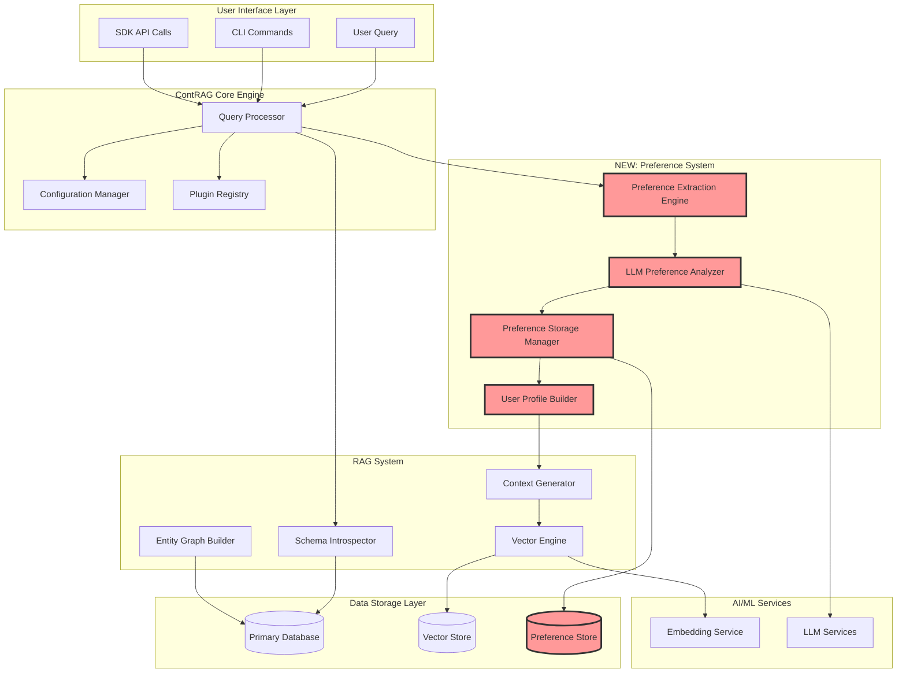
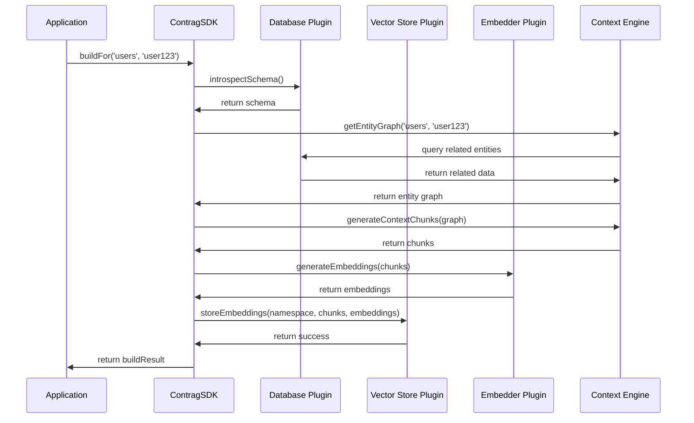
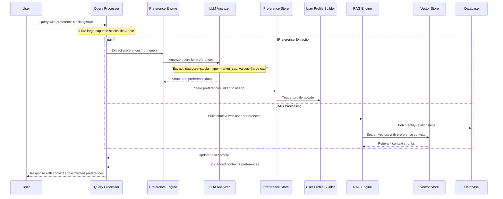
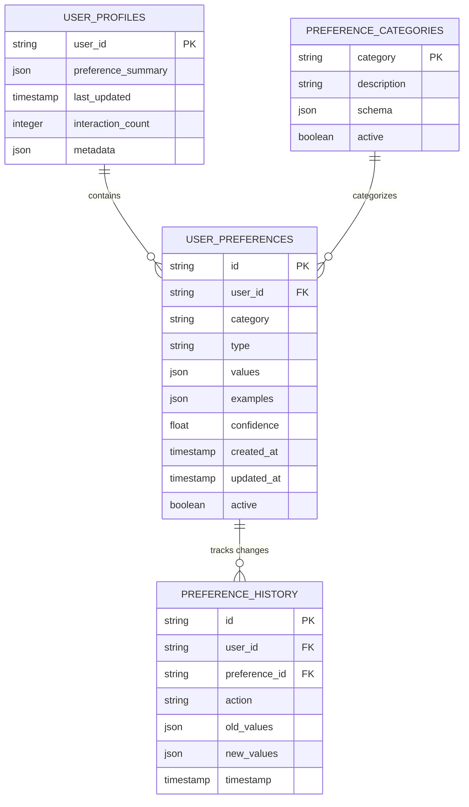
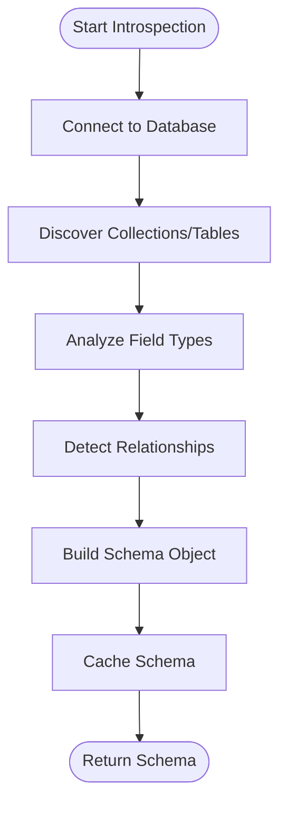
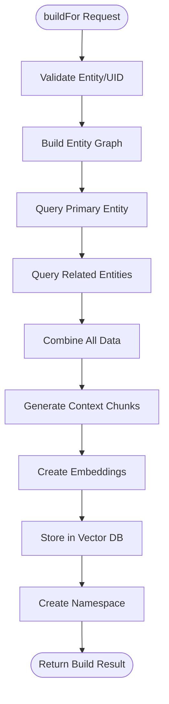
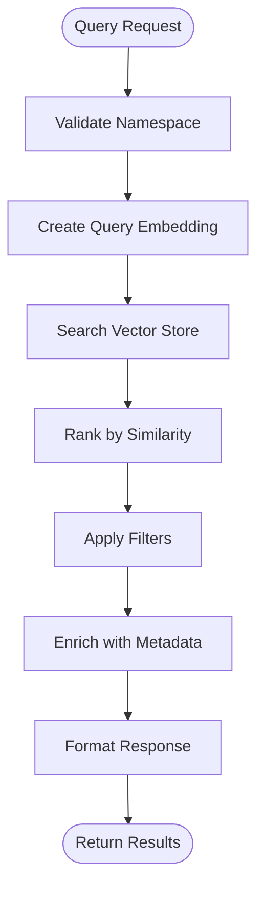
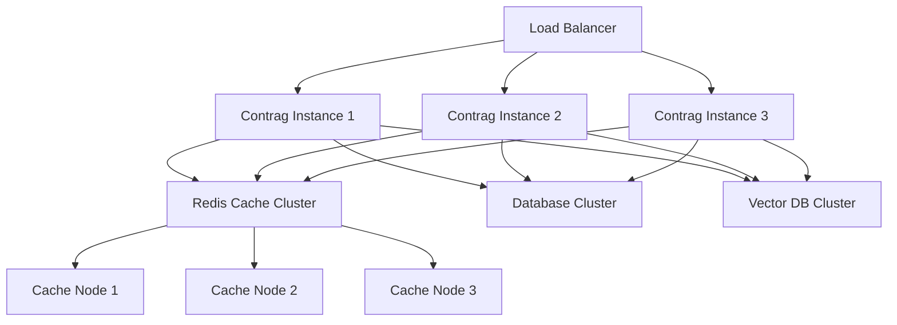

# ContRAG Architecture Guide v1.3.0

## Overview

ContRAG (Contextual Retrieval Augmented Generation) is a TypeScript library that provides configurable RAG (Retrieval-Augmented Generation) capabilities with intelligent preference tracking. The library supports various vector databases and embedding providers through a plugin-based architecture.

**New in v1.3.0:** Intelligent Preference Tracking system that learns from user interactions to provide personalized responses.

## Table of Contents

1. [Core Architecture](#core-architecture)
2. [Intelligent Preference System (NEW)](#intelligent-preference-system-new)
3. [Plugin System](#plugin-system)
4. [Configuration Management](#configuration-management)
5. [Context Building](#context-building)
6. [Error Handling](#error-handling)
7. [Performance Optimization](#performance-optimization)
8. [Security Architecture](#security-architecture)
9. [Scalability Considerations](#scalability-considerations)
10. [Migration from Previous Versions](#migration-from-previous-versions)

## Core Architecture

### High-Level Architecture v1.3.0



### Component Interaction Flow



##  NEW: Preference System Architecture

### Preference Extraction Data Flow



### Preference Data Architecture



## Core Components

### 1. ContragSDK (Main Interface)

The primary interface that orchestrates all operations and manages plugin interactions.

```typescript
class ContragSDK {
  private databasePlugin: DatabasePlugin;
  private vectorStorePlugin: VectorStorePlugin;
  private embedderPlugin: EmbedderPlugin;
  private contextEngine: ContextEngine;
  
  async configure(config: ContragConfig): Promise<void>
  async buildFor(entity: string, uid: string, options?: BuildOptions): Promise<BuildResult>
  async query(namespace: string, question: string, limit?: number): Promise<QueryResult>
  async introspectSchema(): Promise<EntitySchema[]>
  async getEntityGraph(entity: string, uid: string): Promise<EntityGraph>
}
```

**Key Responsibilities:**
- Plugin lifecycle management
- Configuration validation
- Cross-plugin orchestration
- Error handling and recovery
- Performance monitoring

### 2. Context Engine

The brain of Contrag that handles entity relationship mapping, context building, and chunking strategies.

```typescript
class ContextEngine {
  private schemaIntrospector: SchemaIntrospector;
  private relationshipMapper: RelationshipMapper;
  private chunkGenerator: ChunkGenerator;
  
  async buildEntityGraph(entity: string, uid: string): Promise<EntityGraph>
  async generateContextChunks(graph: EntityGraph): Promise<ContextChunk[]>
  async optimizeChunking(data: any[], strategy: ChunkingStrategy): Promise<ContextChunk[]>
}
```

**Key Features:**
- **Schema Introspection** - Automatic discovery of database structure
- **Relationship Detection** - Intelligent mapping of entity relationships
- **Context Optimization** - Smart chunking based on data semantics
- **Metadata Enrichment** - Addition of contextual information

### 3. Plugin System

Contrag uses a plugin architecture to support multiple databases, vector stores, and embedding providers.

```typescript
interface Plugin {
  name: string;
  version: string;
  initialize(config: PluginConfig): Promise<void>;
  destroy(): Promise<void>;
}

interface DatabasePlugin extends Plugin {
  introspectSchema(): Promise<EntitySchema[]>;
  queryEntity(entity: string, uid: string): Promise<any>;
  queryRelatedEntities(entity: string, uid: string, relationships: Relationship[]): Promise<any[]>;
}

interface VectorStorePlugin extends Plugin {
  storeEmbeddings(namespace: string, chunks: ContextChunk[], embeddings: number[][]): Promise<void>;
  searchSimilar(namespace: string, queryEmbedding: number[], limit: number): Promise<SearchResult[]>;
  deleteNamespace(namespace: string): Promise<void>;
}

interface EmbedderPlugin extends Plugin {
  generateEmbeddings(texts: string[]): Promise<number[][]>;
  getDimensions(): number;
  getModel(): string;
}
```

## Data Flow

### 1. Schema Introspection Flow



### 2. Entity Context Building Flow



### 3. Query Processing Flow



## Plugin Architecture

### Plugin Loading Mechanism

```typescript
class PluginManager {
  private plugins: Map<string, Plugin> = new Map();
  
  async loadPlugin(type: PluginType, name: string, config: PluginConfig): Promise<Plugin> {
    const PluginClass = await this.resolvePlugin(type, name);
    const plugin = new PluginClass();
    await plugin.initialize(config);
    this.plugins.set(`${type}:${name}`, plugin);
    return plugin;
  }
  
  private async resolvePlugin(type: PluginType, name: string): Promise<typeof Plugin> {
    // Built-in plugins
    const builtInPath = `./plugins/${type}/${name}`;
    try {
      return require(builtInPath).default;
    } catch (error) {
      // External plugins
      const externalPath = `contrag-plugin-${type}-${name}`;
      return require(externalPath).default;
    }
  }
}
```

### Database Plugin Implementation

```typescript
// MongoDB Plugin Example
class MongoDBPlugin implements DatabasePlugin {
  private client: MongoClient;
  private db: Db;
  
  async initialize(config: MongoDBConfig): Promise<void> {
    this.client = new MongoClient(config.url);
    await this.client.connect();
    this.db = this.client.db(config.database);
  }
  
  async introspectSchema(): Promise<EntitySchema[]> {
    const collections = await this.db.listCollections().toArray();
    const entities: EntitySchema[] = [];
    
    for (const collection of collections) {
      const sampleDoc = await this.db.collection(collection.name).findOne();
      const fields = this.extractFields(sampleDoc);
      
      entities.push({
        name: collection.name,
        type: 'collection',
        fields,
        relationships: await this.detectRelationships(collection.name, fields)
      });
    }
    
    return entities;
  }
  
  private async detectRelationships(collectionName: string, fields: Field[]): Promise<Relationship[]> {
    const relationships: Relationship[] = [];
    
    for (const field of fields) {
      if (this.isReferenceField(field.name)) {
        const targetEntity = this.inferTargetEntity(field.name);
        if (await this.validateRelationship(collectionName, field.name, targetEntity)) {
          relationships.push({
            type: 'belongsTo',
            targetEntity,
            localKey: field.name,
            foreignKey: '_id'
          });
        }
      }
    }
    
    return relationships;
  }
}
```

## Entity Relationship Engine

### Relationship Detection Algorithm

The relationship detection engine uses multiple strategies to identify connections between entities:

#### 1. Field Name Pattern Analysis
```typescript
class RelationshipDetector {
  private readonly REFERENCE_PATTERNS = [
    /^(.+)Id$/,           // userId, productId
    /^(.+)_id$/,          // user_id, product_id  
    /^(.+)Ref$/,          // userRef, orderRef
    /^(.+)Reference$/     // userReference
  ];
  
  detectByFieldName(fieldName: string): string | null {
    for (const pattern of this.REFERENCE_PATTERNS) {
      const match = fieldName.match(pattern);
      if (match) {
        return this.pluralize(match[1]); // userId -> users
      }
    }
    return null;
  }
}
```

#### 2. Value Type Analysis
```typescript
async detectByValueType(entity: string, field: string): Promise<Relationship | null> {
  const sampleValues = await this.database.getSampleValues(entity, field, 100);
  
  // Check if values look like ObjectIds
  if (sampleValues.every(v => this.isObjectIdFormat(v))) {
    const targetEntity = await this.findEntityWithMatchingIds(sampleValues);
    if (targetEntity) {
      return {
        type: 'belongsTo',
        targetEntity,
        localKey: field,
        foreignKey: '_id',
        confidence: 0.9
      };
    }
  }
  
  return null;
}
```

#### 3. Statistical Analysis
```typescript
async detectByStatistics(entity: string, field: string): Promise<Relationship | null> {
  const stats = await this.database.getFieldStatistics(entity, field);
  
  // High cardinality suggests reference field
  if (stats.uniqueValues / stats.totalCount > 0.8) {
    const potentialTargets = await this.findPotentialTargetEntities();
    
    for (const target of potentialTargets) {
      const matchRatio = await this.calculateMatchRatio(entity, field, target, '_id');
      if (matchRatio > 0.7) {
        return {
          type: 'belongsTo',
          targetEntity: target,
          localKey: field,
          foreignKey: '_id',
          confidence: matchRatio
        };
      }
    }
  }
  
  return null;
}
```

### Entity Graph Construction

```typescript
class EntityGraphBuilder {
  async buildGraph(rootEntity: string, rootUid: string, maxDepth: number = 3): Promise<EntityGraph> {
    const graph: EntityGraph = {
      root: { entity: rootEntity, uid: rootUid },
      nodes: new Map(),
      edges: [],
      depth: 0
    };
    
    const queue: GraphNode[] = [{ entity: rootEntity, uid: rootUid, depth: 0 }];
    const visited = new Set<string>();
    
    while (queue.length > 0) {
      const current = queue.shift()!;
      const nodeKey = `${current.entity}:${current.uid}`;
      
      if (visited.has(nodeKey) || current.depth > maxDepth) {
        continue;
      }
      
      visited.add(nodeKey);
      graph.nodes.set(nodeKey, current);
      
      // Find related entities
      const relationships = await this.getRelationships(current.entity);
      
      for (const relationship of relationships) {
        const relatedNodes = await this.queryRelatedNodes(current, relationship);
        
        for (const relatedNode of relatedNodes) {
          const edge: GraphEdge = {
            from: nodeKey,
            to: `${relatedNode.entity}:${relatedNode.uid}`,
            relationship: relationship.type,
            weight: this.calculateEdgeWeight(relationship)
          };
          
          graph.edges.push(edge);
          
          if (relatedNode.depth < maxDepth) {
            queue.push(relatedNode);
          }
        }
      }
    }
    
    graph.depth = Math.max(...Array.from(graph.nodes.values()).map(n => n.depth));
    return graph;
  }
}
```

## Vector Storage & Retrieval

### Embedding Strategy

```typescript
class EmbeddingManager {
  async generateContextEmbeddings(chunks: ContextChunk[]): Promise<EmbeddingResult[]> {
    const results: EmbeddingResult[] = [];
    
    // Batch processing for efficiency
    const batches = this.createBatches(chunks, this.BATCH_SIZE);
    
    for (const batch of batches) {
      const texts = batch.map(chunk => this.prepareTextForEmbedding(chunk));
      const embeddings = await this.embedder.generateEmbeddings(texts);
      
      for (let i = 0; i < batch.length; i++) {
        results.push({
          chunk: batch[i],
          embedding: embeddings[i],
          metadata: this.enrichMetadata(batch[i])
        });
      }
    }
    
    return results;
  }
  
  private prepareTextForEmbedding(chunk: ContextChunk): string {
    // Combine content with structured metadata for better embeddings
    const metadataText = [
      `Entity: ${chunk.metadata.entity}`,
      `Type: ${chunk.metadata.type}`,
      chunk.metadata.timestamp && `Date: ${chunk.metadata.timestamp}`,
      chunk.metadata.tags && `Tags: ${chunk.metadata.tags.join(', ')}`
    ].filter(Boolean).join('\n');
    
    return `${metadataText}\n\nContent:\n${chunk.content}`;
  }
}
```

### Vector Search Optimization

```typescript
class VectorSearchOptimizer {
  async searchWithStrategy(
    namespace: string, 
    query: string, 
    limit: number, 
    strategy: SearchStrategy = 'hybrid'
  ): Promise<SearchResult[]> {
    
    switch (strategy) {
      case 'semantic':
        return this.semanticSearch(namespace, query, limit);
        
      case 'keyword':
        return this.keywordSearch(namespace, query, limit);
        
      case 'hybrid':
        return this.hybridSearch(namespace, query, limit);
        
      default:
        throw new Error(`Unknown search strategy: ${strategy}`);
    }
  }
  
  private async hybridSearch(namespace: string, query: string, limit: number): Promise<SearchResult[]> {
    // Combine semantic and keyword search
    const [semanticResults, keywordResults] = await Promise.all([
      this.semanticSearch(namespace, query, limit * 2),
      this.keywordSearch(namespace, query, limit * 2)
    ]);
    
    // Merge and re-rank results
    const merged = this.mergeSearchResults(semanticResults, keywordResults);
    const reranked = this.rerankResults(merged, query);
    
    return reranked.slice(0, limit);
  }
  
  private rerankResults(results: SearchResult[], query: string): SearchResult[] {
    return results.map(result => ({
      ...result,
      score: this.calculateHybridScore(result, query)
    })).sort((a, b) => b.score - a.score);
  }
  
  private calculateHybridScore(result: SearchResult, query: string): number {
    const semanticWeight = 0.7;
    const keywordWeight = 0.3;
    
    const semanticScore = result.semanticScore || 0;
    const keywordScore = this.calculateKeywordScore(result.content, query);
    
    return (semanticScore * semanticWeight) + (keywordScore * keywordWeight);
  }
}
```

## Context Building Strategy

### Intelligent Chunking

```typescript
class IntelligentChunker {
  async chunkEntityData(
    entityData: any, 
    options: ChunkingOptions
  ): Promise<ContextChunk[]> {
    
    const strategy = this.selectChunkingStrategy(entityData, options);
    
    switch (strategy) {
      case 'semantic':
        return this.semanticChunking(entityData, options);
        
      case 'structural':
        return this.structuralChunking(entityData, options);
        
      case 'hybrid':
        return this.hybridChunking(entityData, options);
        
      default:
        return this.basicChunking(entityData, options);
    }
  }
  
  private async semanticChunking(entityData: any, options: ChunkingOptions): Promise<ContextChunk[]> {
    // Use NLP to identify semantic boundaries
    const text = this.entityToText(entityData);
    const sentences = await this.nlp.segmentSentences(text);
    const topics = await this.nlp.identifyTopics(sentences);
    
    const chunks: ContextChunk[] = [];
    let currentChunk = '';
    let currentTopic = topics[0];
    
    for (let i = 0; i < sentences.length; i++) {
      const sentence = sentences[i];
      const topic = topics[i];
      
      // Start new chunk if topic changes or size limit reached
      if (topic !== currentTopic || currentChunk.length + sentence.length > options.maxSize) {
        if (currentChunk) {
          chunks.push(this.createChunk(currentChunk, currentTopic, entityData));
        }
        currentChunk = sentence;
        currentTopic = topic;
      } else {
        currentChunk += ' ' + sentence;
      }
    }
    
    if (currentChunk) {
      chunks.push(this.createChunk(currentChunk, currentTopic, entityData));
    }
    
    return chunks;
  }
  
  private structuralChunking(entityData: any, options: ChunkingOptions): Promise<ContextChunk[]> {
    // Chunk based on data structure (objects, arrays, etc.)
    const chunks: ContextChunk[] = [];
    
    if (Array.isArray(entityData)) {
      // Split arrays into manageable chunks
      const itemsPerChunk = Math.ceil(options.maxSize / this.averageItemSize(entityData));
      
      for (let i = 0; i < entityData.length; i += itemsPerChunk) {
        const chunkData = entityData.slice(i, i + itemsPerChunk);
        chunks.push(this.createChunk(this.formatData(chunkData), 'array_items', entityData));
      }
    } else if (typeof entityData === 'object') {
      // Split objects by logical groupings
      const groups = this.groupObjectFields(entityData);
      
      for (const [groupName, fields] of Object.entries(groups)) {
        const groupData = this.extractFields(entityData, fields);
        chunks.push(this.createChunk(this.formatData(groupData), groupName, entityData));
      }
    }
    
    return Promise.resolve(chunks);
  }
}
```

### Context Enrichment

```typescript
class ContextEnricher {
  async enrichChunks(chunks: ContextChunk[], entityGraph: EntityGraph): Promise<ContextChunk[]> {
    const enrichedChunks: ContextChunk[] = [];
    
    for (const chunk of chunks) {
      const enriched = await this.enrichSingleChunk(chunk, entityGraph);
      enrichedChunks.push(enriched);
    }
    
    return enrichedChunks;
  }
  
  private async enrichSingleChunk(chunk: ContextChunk, graph: EntityGraph): Promise<ContextChunk> {
    const enriched = { ...chunk };
    
    // Add relationship context
    enriched.metadata.relationships = this.extractRelationshipInfo(chunk, graph);
    
    // Add temporal context
    enriched.metadata.temporalContext = this.extractTemporalContext(chunk);
    
    // Add semantic tags
    enriched.metadata.semanticTags = await this.generateSemanticTags(chunk.content);
    
    // Add importance score
    enriched.metadata.importance = this.calculateImportanceScore(chunk, graph);
    
    return enriched;
  }
  
  private calculateImportanceScore(chunk: ContextChunk, graph: EntityGraph): number {
    let score = 0.5; // Base score
    
    // Boost score for central entities
    if (this.isCentralEntity(chunk.metadata.entity, graph)) {
      score += 0.2;
    }
    
    // Boost score for recent data
    if (this.isRecentData(chunk.metadata.timestamp)) {
      score += 0.1;
    }
    
    // Boost score for high-relationship entities
    const relationshipCount = this.getRelationshipCount(chunk.metadata.entity, graph);
    score += Math.min(relationshipCount * 0.05, 0.2);
    
    return Math.min(score, 1.0);
  }
}
```

## Performance Optimizations

### Caching Layer

```typescript
class ContragCache {
  private schemaCache: LRUCache<string, EntitySchema[]>;
  private graphCache: LRUCache<string, EntityGraph>;
  private embeddingCache: LRUCache<string, number[]>;
  private resultCache: LRUCache<string, SearchResult[]>;
  
  constructor(options: CacheOptions) {
    this.schemaCache = new LRUCache({ max: options.schemaMaxSize || 100 });
    this.graphCache = new LRUCache({ max: options.graphMaxSize || 1000 });
    this.embeddingCache = new LRUCache({ max: options.embeddingMaxSize || 10000 });
    this.resultCache = new LRUCache({ 
      max: options.resultMaxSize || 5000,
      ttl: options.resultTTL || 5 * 60 * 1000 // 5 minutes
    });
  }
  
  async getCachedSchema(databaseKey: string): Promise<EntitySchema[] | null> {
    return this.schemaCache.get(databaseKey) || null;
  }
  
  async setCachedSchema(databaseKey: string, schema: EntitySchema[]): Promise<void> {
    this.schemaCache.set(databaseKey, schema);
  }
  
  async getCachedGraph(entity: string, uid: string): Promise<EntityGraph | null> {
    return this.graphCache.get(`${entity}:${uid}`) || null;
  }
  
  async invalidateNamespace(namespace: string): Promise<void> {
    // Remove all cached data for this namespace
    const keysToRemove = [];
    
    for (const key of this.graphCache.keys()) {
      if (key.startsWith(namespace)) {
        keysToRemove.push(key);
      }
    }
    
    keysToRemove.forEach(key => {
      this.graphCache.delete(key);
      this.resultCache.delete(key);
    });
  }
}
```

### Batch Processing

```typescript
class BatchProcessor {
  async processBatch<T, R>(
    items: T[],
    processor: (batch: T[]) => Promise<R[]>,
    batchSize: number = 100,
    concurrency: number = 3
  ): Promise<R[]> {
    
    const batches = this.createBatches(items, batchSize);
    const results: R[] = [];
    
    // Process batches with controlled concurrency
    const semaphore = new Semaphore(concurrency);
    
    const batchPromises = batches.map(async (batch) => {
      await semaphore.acquire();
      try {
        const batchResults = await processor(batch);
        results.push(...batchResults);
      } finally {
        semaphore.release();
      }
    });
    
    await Promise.all(batchPromises);
    return results;
  }
  
  private createBatches<T>(items: T[], batchSize: number): T[][] {
    const batches: T[][] = [];
    for (let i = 0; i < items.length; i += batchSize) {
      batches.push(items.slice(i, i + batchSize));
    }
    return batches;
  }
}
```

### Connection Pooling

```typescript
class ConnectionPool {
  private pools: Map<string, Pool> = new Map();
  
  async getConnection(pluginType: string, config: any): Promise<Connection> {
    const poolKey = `${pluginType}:${this.hashConfig(config)}`;
    
    let pool = this.pools.get(poolKey);
    if (!pool) {
      pool = this.createPool(pluginType, config);
      this.pools.set(poolKey, pool);
    }
    
    return pool.acquire();
  }
  
  private createPool(pluginType: string, config: any): Pool {
    switch (pluginType) {
      case 'mongodb':
        return new MongoDBPool(config);
      case 'postgresql':
        return new PostgreSQLPool(config);
      default:
        throw new Error(`Unknown plugin type: ${pluginType}`);
    }
  }
}
```

## Security Architecture

### Access Control

```typescript
class AccessController {
  private permissions: Map<string, Permission[]> = new Map();
  
  async checkPermission(
    userId: string, 
    action: Action, 
    resource: Resource
  ): Promise<boolean> {
    
    const userPermissions = this.permissions.get(userId) || [];
    
    return userPermissions.some(permission => 
      this.permissionMatches(permission, action, resource)
    );
  }
  
  async secureQuery(
    userId: string,
    namespace: string,
    query: string,
    limit: number
  ): Promise<SearchResult[]> {
    
    // Extract entity and uid from namespace
    const [entity, uid] = namespace.split(':');
    
    // Check if user can access this entity
    const canAccess = await this.checkPermission(userId, 'read', {
      type: 'entity',
      entity,
      uid
    });
    
    if (!canAccess) {
      throw new UnauthorizedError('Access denied to entity');
    }
    
    // Execute query with user context
    const results = await this.sdk.query(namespace, query, limit);
    
    // Filter results based on field-level permissions
    return this.filterResults(results, userId);
  }
  
  private async filterResults(results: SearchResult[], userId: string): Promise<SearchResult[]> {
    const filtered: SearchResult[] = [];
    
    for (const result of results) {
      const filteredContent = await this.filterSensitiveData(result.content, userId);
      if (filteredContent) {
        filtered.push({
          ...result,
          content: filteredContent
        });
      }
    }
    
    return filtered;
  }
}
```

### Data Sanitization

```typescript
class DataSanitizer {
  private sensitivePatterns = [
    /\b\d{4}[-\s]?\d{4}[-\s]?\d{4}[-\s]?\d{4}\b/, // Credit cards
    /\b\d{3}-\d{2}-\d{4}\b/, // SSN
    /\b[A-Za-z0-9._%+-]+@[A-Za-z0-9.-]+\.[A-Z|a-z]{2,}\b/, // Emails
    /\b(?:\+?1[-.\s]?)?\(?[0-9]{3}\)?[-.\s]?[0-9]{3}[-.\s]?[0-9]{4}\b/ // Phone numbers
  ];
  
  sanitizeForEmbedding(content: string, options: SanitizationOptions = {}): string {
    let sanitized = content;
    
    // Remove or mask sensitive data
    if (options.maskSensitive !== false) {
      for (const pattern of this.sensitivePatterns) {
        sanitized = sanitized.replace(pattern, '[REDACTED]');
      }
    }
    
    // Remove PII based on field names
    if (options.removePII !== false) {
      sanitized = this.removePIIFields(sanitized);
    }
    
    return sanitized;
  }
  
  private removePIIFields(content: string): string {
    const piiFields = ['password', 'ssn', 'creditCard', 'bankAccount'];
    
    for (const field of piiFields) {
      const regex = new RegExp(`${field}:\\s*[^\\n,}]+`, 'gi');
      content = content.replace(regex, `${field}: [REDACTED]`);
    }
    
    return content;
  }
}
```

## Scalability Considerations

### Horizontal Scaling Architecture



### Distributed Processing

```typescript
class DistributedProcessor {
  private workerPool: WorkerPool;
  private messageQueue: MessageQueue;
  
  async distributedBuild(
    entity: string, 
    uid: string, 
    options: BuildOptions
  ): Promise<BuildResult> {
    
    // Split work into smaller tasks
    const tasks = await this.createBuildTasks(entity, uid, options);
    
    // Distribute tasks across workers
    const taskPromises = tasks.map(task => 
      this.messageQueue.publish('build_task', task)
    );
    
    // Wait for all tasks to complete
    const taskResults = await Promise.all(taskPromises);
    
    // Combine results
    return this.combineBuildResults(taskResults);
  }
  
  private async createBuildTasks(
    entity: string, 
    uid: string, 
    options: BuildOptions
  ): Promise<BuildTask[]> {
    
    const entityGraph = await this.getEntityGraph(entity, uid);
    const tasks: BuildTask[] = [];
    
    // Create task for each related entity
    for (const relatedEntity of entityGraph.relatedEntities) {
      tasks.push({
        id: generateId(),
        type: 'build_entity',
        entity: relatedEntity.entity,
        uid: uid,
        parentNamespace: `${entity}:${uid}`,
        options
      });
    }
    
    return tasks;
  }
}
```

### Performance Monitoring

```typescript
class PerformanceMonitor {
  private metrics: Map<string, Metric[]> = new Map();
  
  async recordOperation(
    operation: string,
    duration: number,
    metadata: Record<string, any> = {}
  ): Promise<void> {
    
    const metric: Metric = {
      timestamp: Date.now(),
      operation,
      duration,
      metadata
    };
    
    const operationMetrics = this.metrics.get(operation) || [];
    operationMetrics.push(metric);
    
    // Keep only recent metrics (sliding window)
    const cutoff = Date.now() - (24 * 60 * 60 * 1000); // 24 hours
    const filtered = operationMetrics.filter(m => m.timestamp > cutoff);
    
    this.metrics.set(operation, filtered);
    
    // Check for performance issues
    await this.checkPerformanceThresholds(operation, filtered);
  }
  
  async getPerformanceStats(operation: string): Promise<PerformanceStats> {
    const metrics = this.metrics.get(operation) || [];
    
    if (metrics.length === 0) {
      return { count: 0 };
    }
    
    const durations = metrics.map(m => m.duration);
    
    return {
      count: metrics.length,
      avg: durations.reduce((a, b) => a + b) / durations.length,
      min: Math.min(...durations),
      max: Math.max(...durations),
      p95: this.percentile(durations, 0.95),
      p99: this.percentile(durations, 0.99)
    };
  }
}
```

## Integration Patterns

### Microservices Integration

```typescript
class ContragMicroservice {
  private sdk: ContragSDK;
  private server: express.Application;
  
  constructor(config: ContragConfig) {
    this.sdk = new ContragSDK(config);
    this.server = express();
    this.setupRoutes();
  }
  
  private setupRoutes(): void {
    // Health check
    this.server.get('/health', async (req, res) => {
      const health = await this.sdk.healthCheck();
      res.status(health.status === 'ok' ? 200 : 503).json(health);
    });
    
    // Build namespace
    this.server.post('/namespaces', async (req, res) => {
      try {
        const { entity, uid, options } = req.body;
        const result = await this.sdk.buildFor(entity, uid, options);
        res.json(result);
      } catch (error) {
        res.status(400).json({ error: error.message });
      }
    });
    
    // Query namespace
    this.server.post('/query', async (req, res) => {
      try {
        const { namespace, query, limit } = req.body;
        const result = await this.sdk.query(namespace, query, limit);
        res.json(result);
      } catch (error) {
        res.status(400).json({ error: error.message });
      }
    });
  }
  
  async start(port: number): Promise<void> {
    await this.sdk.initialize();
    this.server.listen(port, () => {
      console.log(`Contrag microservice listening on port ${port}`);
    });
  }
}
```

### Event-Driven Architecture

```typescript
class EventDrivenContrag {
  private eventBus: EventBus;
  private sdk: ContragSDK;
  
  constructor(eventBus: EventBus, sdk: ContragSDK) {
    this.eventBus = eventBus;
    this.sdk = sdk;
    this.setupEventHandlers();
  }
  
  private setupEventHandlers(): void {
    // Handle data changes
    this.eventBus.on('entity.created', this.handleEntityCreated.bind(this));
    this.eventBus.on('entity.updated', this.handleEntityUpdated.bind(this));
    this.eventBus.on('entity.deleted', this.handleEntityDeleted.bind(this));
    
    // Handle bulk operations
    this.eventBus.on('bulk.import', this.handleBulkImport.bind(this));
  }
  
  private async handleEntityCreated(event: EntityCreatedEvent): Promise<void> {
    const { entity, uid } = event;
    
    // Check if this entity affects existing namespaces
    const affectedNamespaces = await this.findAffectedNamespaces(entity, uid);
    
    for (const namespace of affectedNamespaces) {
      // Trigger namespace rebuild
      await this.eventBus.emit('namespace.rebuild', { namespace });
    }
    
    // Emit completion event
    await this.eventBus.emit('entity.indexed', { entity, uid });
  }
  
  private async handleEntityUpdated(event: EntityUpdatedEvent): Promise<void> {
    const { entity, uid, changes } = event;
    
    // Determine if changes affect embeddings
    if (this.changesAffectEmbeddings(changes)) {
      const namespace = `${entity}:${uid}`;
      await this.sdk.rebuildNamespace(namespace);
      
      await this.eventBus.emit('namespace.updated', { namespace });
    }
  }
}
```

## Implementation Details

### TypeScript Interfaces

```typescript
// Core interfaces
interface ContragConfig {
  database: PluginConfig;
  vectorStore: PluginConfig;
  embedder: PluginConfig;
  contextBuilder?: ContextBuilderConfig;
  cache?: CacheConfig;
  security?: SecurityConfig;
}

interface PluginConfig {
  plugin: string;
  config: Record<string, any>;
}

interface BuildOptions {
  depth?: number;
  limit?: number;
  includeFields?: string[];
  excludeFields?: string[];
  customChunking?: ChunkingStrategy;
}

interface BuildResult {
  namespace: string;
  chunks: number;
  processingTime: number;
  entityGraph: EntityGraph;
}

interface QueryResult {
  chunks: SearchResult[];
  processingTime: number;
  totalResults: number;
}

interface SearchResult {
  content: string;
  score: number;
  metadata: ChunkMetadata;
}

interface ChunkMetadata {
  entity: string;
  uid: string;
  timestamp?: string;
  source: string;
  depth: number;
  relationships?: string[];
  tags?: string[];
  importance?: number;
}

// Entity and relationship interfaces
interface EntitySchema {
  name: string;
  type: 'collection' | 'table';
  fields: Field[];
  relationships: Relationship[];
  indexes?: Index[];
}

interface Field {
  name: string;
  type: string;
  isRequired?: boolean;
  isUnique?: boolean;
  isReference?: boolean;
}

interface Relationship {
  type: 'hasMany' | 'belongsTo' | 'hasOne';
  targetEntity: string;
  localKey: string;
  foreignKey: string;
  confidence?: number;
}

interface EntityGraph {
  root: { entity: string; uid: string };
  nodes: Map<string, GraphNode>;
  edges: GraphEdge[];
  depth: number;
}

interface GraphNode {
  entity: string;
  uid: string;
  depth: number;
  data?: any;
}

interface GraphEdge {
  from: string;
  to: string;
  relationship: string;
  weight: number;
}
```

### Error Handling Strategy

```typescript
// Custom error types
class ContragError extends Error {
  constructor(
    message: string,
    public code: string,
    public details?: Record<string, any>
  ) {
    super(message);
    this.name = 'ContragError';
  }
}

class PluginError extends ContragError {
  constructor(pluginName: string, message: string, details?: Record<string, any>) {
    super(`Plugin ${pluginName}: ${message}`, 'PLUGIN_ERROR', details);
  }
}

class ValidationError extends ContragError {
  constructor(field: string, message: string) {
    super(`Validation error for ${field}: ${message}`, 'VALIDATION_ERROR');
  }
}

// Error handler middleware
class ErrorHandler {
  static handle(error: Error): ContragError {
    if (error instanceof ContragError) {
      return error;
    }
    
    // Convert common errors
    if (error.message.includes('connection')) {
      return new ContragError('Database connection failed', 'CONNECTION_ERROR', {
        originalError: error.message
      });
    }
    
    if (error.message.includes('not found')) {
      return new ContragError('Resource not found', 'NOT_FOUND', {
        originalError: error.message
      });
    }
    
    // Generic error
    return new ContragError('Internal error', 'INTERNAL_ERROR', {
      originalError: error.message,
      stack: error.stack
    });
  }
}
```

This comprehensive architecture documentation provides detailed insight into how Contrag is designed and implemented, from high-level system architecture to specific implementation details. The modular, plugin-based design ensures extensibility while maintaining performance and security.
