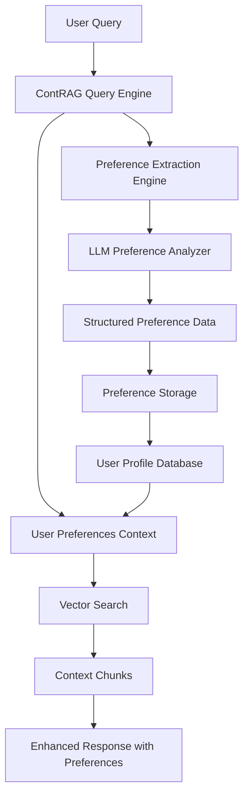

# ContRAG v1.3.0 Release Notes

## 🎉 Major Feature: Intelligent User Preference Tracking

ContRAG v1.3.0 introduces **intelligent preference tracking** that automatically extracts, analyzes, and stores user preferences from natural conversation. This groundbreaking feature enables ContRAG to build dynamic user profiles that enhance personalization over time.

## 🚀 What's New

### 🧠 Smart Preference Extraction
- **AI-Powered Analysis** - Automatically identifies preferences from user queries
- **Structured Storage** - Organized preference data with categories and values
- **Context Awareness** - Links preferences to user interactions and entities
- **Multi-Domain Support** - Works across finance, e-commerce, content, and more

### 🔄 Seamless Integration
- **Query-Level Control** - Enable/disable preference tracking per query
- **Automatic Storage** - Preferences stored in user-linked data models
- **Real-time Processing** - Extract and store preferences during conversation
- **Backwards Compatible** - Optional feature that doesn't affect existing workflows

### 📊 Enhanced User Profiles
- **Dynamic Preferences** - User profiles evolve based on interactions
- **Categorized Data** - Organized by domain (stocks, products, content, etc.)
- **Historical Tracking** - Maintain preference evolution over time
- **Conflict Resolution** - Handle changing or contradicting preferences

## 🎯 Key Features

### Preference Extraction Engine
```javascript
// Automatic preference extraction from user queries
const response = await contrag.query({
  userId: 'user123',
  query: 'I like large cap stocks like Apple and Microsoft',
  masterEntity: 'User'
}, { preferenceTracking: true });

// Extracted preferences stored automatically:
// {
//   "userId": "user123",
//   "preferences": [
//     {
//       "category": "stocks",
//       "type": "market_cap",
//       "values": ["large cap"],
//       "examples": ["Apple", "Microsoft"]
//     }
//   ]
// }
```

### Enhanced Query Response
```javascript
const response = await contrag.query({
  userId: 'user123',
  query: 'Show me investment recommendations',
  masterEntity: 'User'
}, { preferenceTracking: true });

console.log(response.preferences); // Newly extracted preferences
console.log(response.context);     // RAG context with preference-aware results
```

### Preference Management API
```javascript
// Retrieve user preferences
const preferences = await contrag.getUserPreferences('user123');

// Update preferences manually
await contrag.updateUserPreferences('user123', {
  category: 'risk_tolerance',
  type: 'investment_style',
  values: ['conservative']
});

// Clear outdated preferences
await contrag.clearUserPreferences('user123', { olderThan: '30d' });
```

## 🏗️ Architecture Updates

### New Components
- **Preference Extraction Engine** - LLM-based preference analysis
- **Preference Storage Layer** - Structured preference data management
- **User Profile Service** - Dynamic user profile building
- **Preference Integration Module** - Seamless RAG enhancement

### Enhanced Data Flow


## 🛠️ New CLI Commands

### Preference Management
```bash
# View user preferences
contrag preferences show --user-id user123

# Export preferences to JSON
contrag preferences export --user-id user123 --format json

# Clear old preferences  
contrag preferences clear --user-id user123 --older-than 30d

# Analyze preference extraction
contrag preferences analyze --query "I love tech stocks and crypto"

# Test preference extraction
contrag preferences test --input "I prefer sustainable investing"
```

### Enhanced Analytics
```bash
# Preference analytics dashboard
contrag analytics preferences

# User preference trends
contrag analytics trends --user-id user123

# Preference category distribution
contrag analytics categories --timeframe 30d
```

## 📋 SDK Updates

### New Query Options
```typescript
interface QueryOptions {
  preferenceTracking?: boolean;      // Enable preference tracking
  preferenceCategories?: string[];   // Limit extraction to specific categories
  preferenceThreshold?: number;      // Confidence threshold for extraction
  storePreferences?: boolean;        // Auto-store extracted preferences
}
```

### New SDK Methods
```typescript
class ContragSDK {
  // Preference management
  async getUserPreferences(userId: string): Promise<UserPreferences>
  async updateUserPreferences(userId: string, preferences: PreferenceData[]): Promise<void>
  async clearUserPreferences(userId: string, options?: ClearOptions): Promise<void>
  
  // Preference analytics
  async analyzePreferences(userId: string): Promise<PreferenceAnalytics>
  async getPreferenceTrends(userId: string, timeframe?: string): Promise<PreferenceTrends>
  
  // Enhanced query with preferences
  async queryWithPreferences(request: QueryRequest, options: QueryOptions): Promise<EnhancedQueryResponse>
}
```

### Enhanced Response Types
```typescript
interface EnhancedQueryResponse {
  chunks: ContextChunk[];
  preferences?: ExtractedPreferences;  // Newly extracted preferences
  userProfile?: UserProfile;           // Current user profile snapshot
  confidence: number;
  metadata: QueryMetadata;
}

interface ExtractedPreferences {
  userId: string;
  preferences: PreferenceData[];
  extractionConfidence: number;
  timestamp: Date;
}
```

## 🔄 Migration Guide

### From v1.2.x to v1.3.0

#### 1. Update Configuration
```json
{
  "preferences": {
    "enabled": true,
    "extractionModel": "gpt-4",
    "confidenceThreshold": 0.7,
    "storage": {
      "table": "user_preferences",
      "retentionDays": 365
    }
  }
}
```

#### 2. Database Schema Updates
Run the migration script to add preference tables:
```bash
contrag migrate --version 1.3.0
```

#### 3. Update Query Calls (Optional)
```javascript
// Old way (still works)
const response = await contrag.query(userId, query, masterEntity);

// New way with preferences
const response = await contrag.query({
  userId,
  query,
  masterEntity
}, { preferenceTracking: true });
```

## 🎯 Use Cases

### Financial Services
```javascript
// User: "I'm interested in ESG funds and low-risk investments"
const response = await contrag.query({
  userId: 'investor123',
  query: 'Show me suitable investment options',
  masterEntity: 'User'
}, { preferenceTracking: true });

// Automatically extracts and stores:
// - Investment style: ESG focused
// - Risk tolerance: Low risk
// - Asset preferences: Funds
```

### E-commerce
```javascript
// User: "I love sustainable fashion and prefer organic materials"
const response = await contrag.query({
  userId: 'shopper456',
  query: 'Recommend products for me',
  masterEntity: 'User'  
}, { preferenceTracking: true });

// Automatically extracts:
// - Product category: Fashion
// - Values: Sustainability
// - Material preferences: Organic
```

### Content Platforms
```javascript
// User: "I enjoy sci-fi movies and documentary series"
const response = await contrag.query({
  userId: 'viewer789',
  query: 'What should I watch tonight?',
  masterEntity: 'User'
}, { preferenceTracking: true });

// Automatically extracts:
// - Content genre: Sci-fi, Documentary
// - Content type: Movies, Series
```

## 🔒 Privacy & Security

### Data Protection
- **Anonymization Options** - Hash or encrypt preference data
- **Retention Policies** - Automatic preference expiration
- **User Consent** - Explicit opt-in for preference tracking
- **Data Portability** - Export user preferences in standard formats

### Configuration
```json
{
  "preferences": {
    "privacy": {
      "anonymize": true,
      "encryptionKey": "your-key",
      "retentionDays": 90,
      "requireConsent": true
    }
  }
}
```

## 📊 Performance Impact

### Benchmarks
- **Query Latency**: +50-100ms for preference extraction
- **Storage Overhead**: ~1KB per user per 10 interactions
- **Processing**: Batched LLM calls for efficiency
- **Caching**: Extracted preferences cached for 24 hours

### Optimization
```json
{
  "preferences": {
    "performance": {
      "batchSize": 10,
      "cacheTimeout": "24h",
      "asyncProcessing": true,
      "extractionInterval": "5m"
    }
  }
}
```

## 🚨 Breaking Changes

### None! 
v1.3.0 is fully backwards compatible. All existing functionality works unchanged.

### Optional Updates
- Consider enabling preference tracking for enhanced personalization
- Update configuration to customize preference extraction
- Migrate to new enhanced query methods for better control

## 🛣️ Roadmap

### Upcoming Features (v1.4.0)
- **Preference Recommendations** - Suggest preferences based on similar users
- **Cross-Platform Sync** - Share preferences across applications
- **Advanced Analytics** - ML-powered preference insights
- **API Integrations** - Direct integration with recommendation engines

### Long-term Vision (v2.0.0)
- **Federated Preferences** - Cross-organizational preference sharing
- **Real-time Personalization** - Instant preference-based responses
- **Preference Marketplaces** - Anonymized preference insights
- **Advanced Privacy Controls** - Zero-knowledge preference systems

## 🤝 Community

### Feedback & Discussion
- **GitHub Discussions** - Share your preference tracking use cases
- **Discord Community** - Get help with implementation
- **Feature Requests** - Suggest new preference categories

### Contributing
- **Preference Extractors** - Help improve extraction accuracy
- **Privacy Features** - Contribute to data protection capabilities
- **Use Case Examples** - Share real-world implementations

---

**ContRAG v1.3.0** - Intelligent personalization through automated preference learning.

Ready to build AI that truly understands your users? [Get started with preference tracking →](docs/USER_GUIDE.md#preference-tracking)
